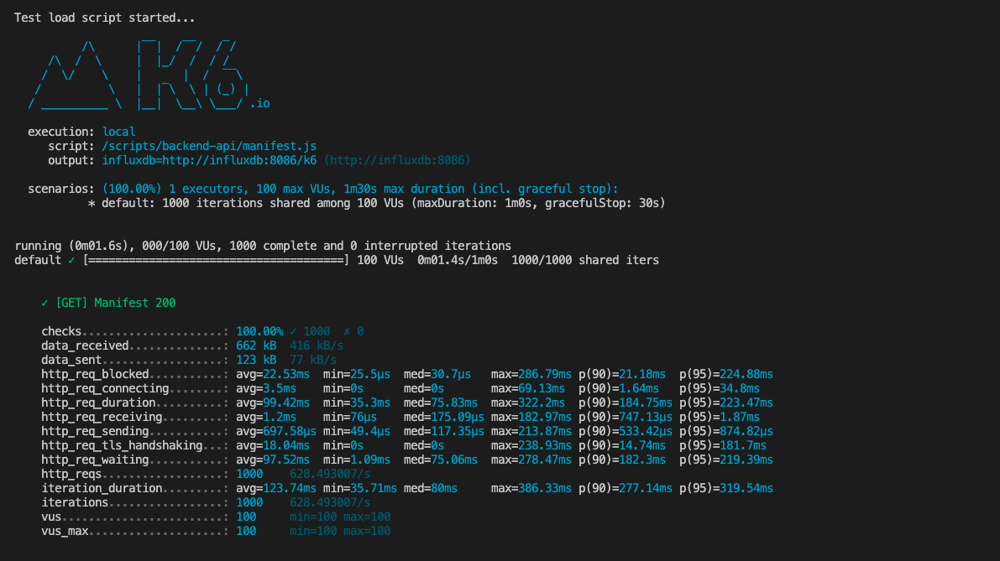
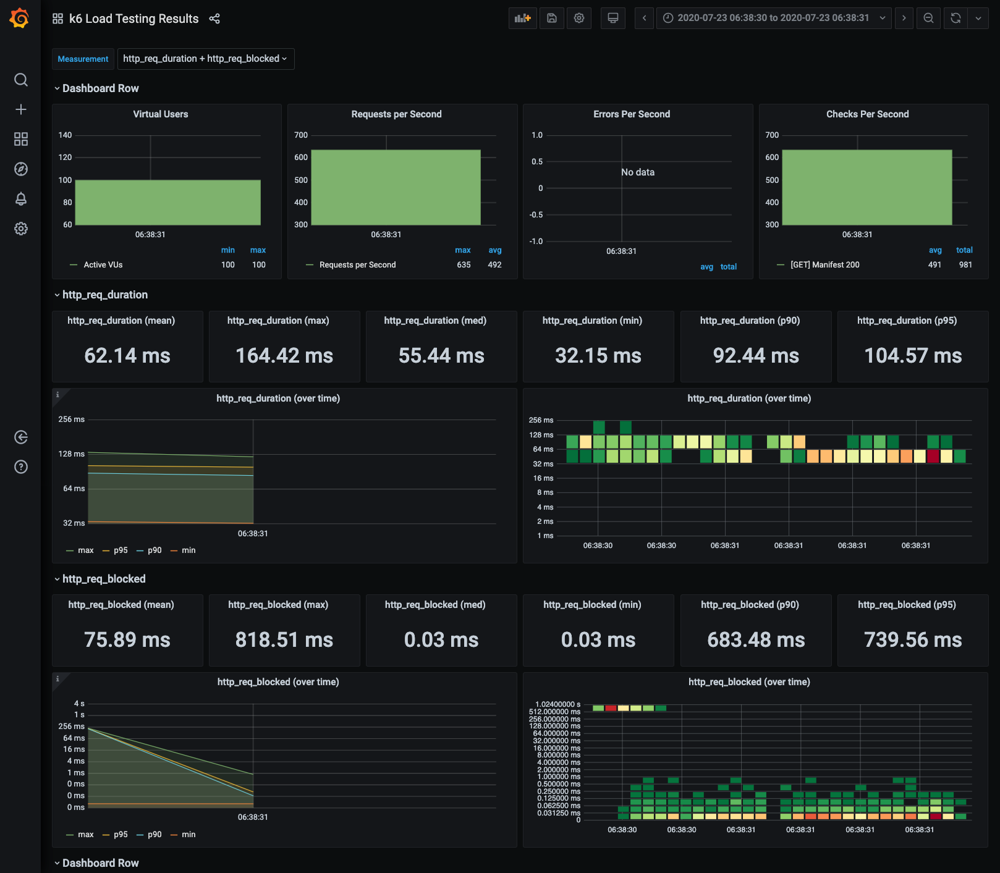
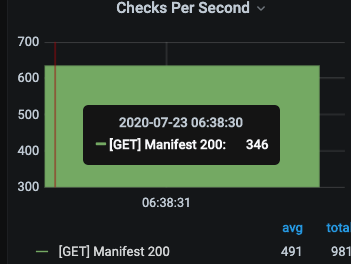

# POC: Load tests against API Rest

## Objective

This project will handle the load tests for backend API.

Include:
- Regular request (`load_scripts/backend-api/manifest.js`)
- Login simple request (`load_scripts/backend-api/login.js`)
- JWT Request (including token request) (`load_scripts/backend-api/checkToken.js`)
- Random payload generated requests (using Faker.js) (`load_scripts/backend-api/register.js`)

## Targets

### Terminal support

The scripts provide a simplified visual report with testings and validations



### Grafana Dashboard support

There is an easy option to debug any performance issue using a full featured dashboard.



#### Advance details

As well is possible to check details in depth.



## Usage

### Infrastructure

```bash
npm run infra:build   # Build docker-compose
npm run infra:start   # Up docker-compose
npm run infra:stop    # Down docker-compose
```

## Preparation

### Handle secrets

You should create a `.env` file at the same level as the `docker-compose.yml`. Those environmental variables will be injected to the K6 docker image.

Variables needed:

```text
BACKEND_BASE_URL
USER_EMAIL
USER_PASS
```

## Run the tests

### Start the environment

```bash
npm run infra:start
```

### Handle Dashboard

By default there is no dashboard attached to Grafana. So please follow the steps.

1. Enter to import dashboard: http://localhost:3000/dashboard/import
2. Add `2587` to `Grafana.com Dashboard` and click `Load``
3. On the new screen select `myfluxdb` as the value for `k6` field and click `import`
4. You will redirected to the dashboard

### Execute the tests

Update the `.env` with the information needed.

Note: If you need to access to a running server outside the container, you can use `host.docker.internal`, like:

```
BACKEND_BASE_URL=http://host.docker.internal:4000
```


To run the tests:

```bash
npm run load-test:run
```

:warning: Note: the tests can take a while 5 minutes or more. So please check the terminal and the dashboard
